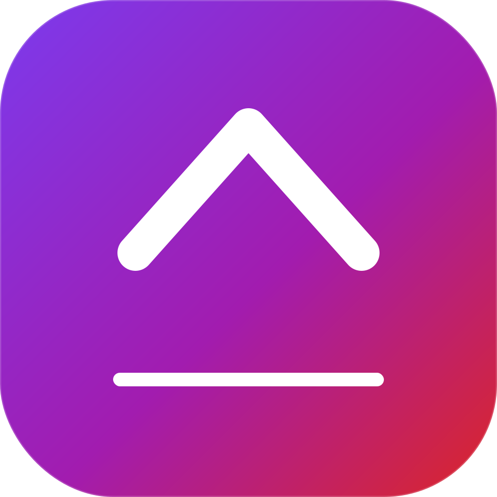

<p align="center">
  
</p>

# DockXI — Floating Dock for Windows

A floating, always-on-top dock for Windows built on **WPF + .NET 8**, inspired by the macOS dock. This document is the developer guide; the [repository root README](../README.md) has the user-facing summary.

---

## Table of Contents

1. [System Requirements](#system-requirements)
2. [Build & Run](#build--run)
3. [Solution Layout](#solution-layout)
4. [Architecture](#architecture)
5. [Runtime Composition (DI)](#runtime-composition-di)
6. [Drag-and-Drop Pipeline](#drag-and-drop-pipeline)
7. [Dock Sizing & Window Hacks](#dock-sizing--window-hacks)
8. [UI Tunable Constants](#ui-tunable-constants)
9. [Configuration & Storage](#configuration--storage)
10. [Testing](#testing)
11. [Known Gotchas](#known-gotchas)
12. [Roadmap](#roadmap)

---

## System Requirements

| Item | Value |
|------|-------|
| **OS minimum** | Windows 10 build 19041 (2004) |
| **OS recommended** | Windows 11 22H2+ (Mica, rounded corners) |
| **.NET SDK** | 8.0.x |
| **Visual Studio** | 2022 17.8+ with **".NET desktop development"** workload (WPF) |
| **Architecture** | x64 (Platforms = x64 in csproj) |

---

## Build & Run

### Visual Studio

1. Open `DockXI.sln`
2. Set **DockXI.WpfShell** as Startup Project (right-click → Set as Startup Project)
3. Press **F5**

### CLI

```powershell
dotnet restore
dotnet build  DockXI.sln -c Release
dotnet test   DockXI.sln -c Release          # run unit tests
dotnet run    --project src\DockXI.WpfShell  # run the dock
```

### Publishing

```powershell
dotnet publish src\DockXI.WpfShell -c Release -r win-x64 --self-contained false
# Output: src\DockXI.WpfShell\bin\Release\net8.0-windows10.0.19041.0\publish\
```

---

## Solution Layout

```
DockXI.sln
Directory.Build.props        ← global compiler flags (Nullable, TreatWarningsAsErrors, NuGetAudit=false)
Directory.Packages.props     ← Central Package Management — version pins live here
assets/
└── icon.svg                 ← app icon master (1024×1024, purple→red gradient + white caret + dock bar)

src/
├── DockXI.Core/                       ← Domain layer, no UI dependency
│   ├── Abstractions/                  ← Interfaces + DTOs (was DockXI.Contracts)
│   │   ├── IPinnedItemRepository.cs
│   │   ├── ILaunchService.cs
│   │   ├── IIconExtractor.cs
│   │   ├── IShortcutResolver.cs
│   │   ├── IDockConfigStore.cs
│   │   ├── IAppSettingsStore.cs
│   │   ├── IStorageLocations.cs
│   │   ├── IRevealZoneHost.cs
│   │   ├── IUiDispatcher.cs
│   │   ├── DockConfigDocument.cs
│   │   └── Defaults.cs
│   ├── DockHost/                      ← PinnedItemRepository, PinFactory, ShellLinkResolver
│   ├── IconExtraction/                ← IconExtractor (SHGetFileInfo + favicon fetch)
│   ├── LaunchService/                 ← ShellExecute + 1 Hz running-process snapshot
│   ├── Settings/                      ← DockConfigStore, AppSettingsStore
│   ├── Storage/                       ← Atomic JSON config writer
│   ├── Diagnostics/                   ← FileLoggerProvider, InMemoryLogStore
│   └── Monitors/                      ← RevealZoneHostStub (auto-hide hook point)
│
├── DockXI.WpfShell/                   ← WPF executable
│   ├── App.xaml + App.xaml.cs         ← Generic Host bootstrap + DI registrations
│   ├── MainDockWindow.xaml + .cs      ← The dock window itself
│   ├── PinnedItemViewModel.cs         ← INPC view-model wrapping PinnedItem
│   ├── WpfStorageLocations.cs         ← %LOCALAPPDATA% paths
│   ├── WpfUiDispatcher.cs             ← IUiDispatcher → WPF Dispatcher
│   └── WpfRevealZoneHost.cs           ← IRevealZoneHost (auto-hide, partial)
│
tests/
└── DockXI.Tests/                      ← xUnit + Moq, references Core only
```

> **Why no `DockXI.Contracts` project?** Interfaces used to live in a separate assembly so multiple shells (WinUI + WPF) could share them. After the WinUI shell was deleted, the split stopped paying for itself and Contracts was merged into `Core/Abstractions/`. The `DockXI.Contracts` **namespace** is preserved so test and shell code didn't change.

---

## Architecture

### Layers

```
┌─────────────────────────────────────────────────────────────┐
│  DockXI.WpfShell  (UI, XAML, view-model, WPF adapters)      │
└───────────────────────────┬─────────────────────────────────┘
                            │  depends on
┌───────────────────────────▼─────────────────────────────────┐
│  DockXI.Core                                                │
│  ├── Abstractions/  ← interfaces + DTOs (namespace          │
│  │                    DockXI.Contracts kept for stability)  │
│  └── implementations grouped by feature folder              │
└─────────────────────────────────────────────────────────────┘
```

`DockXI.Tests` references `DockXI.Core` only — no UI dependency, no DI host required, every interface is mockable.

### Key Patterns

| Pattern | Where | Why |
|---------|-------|-----|
| **Generic Host + DI** | `App.xaml.cs` | Lifecycle + service registration via `ConfigureServices(...)` |
| **Repository + events** | `IPinnedItemRepository` | UI subscribes to `ItemAdded`/`ItemRemoved`, never mutates the collection directly |
| **CPM** | `Directory.Packages.props` | Single version source for every NuGet package |
| **`InternalsVisibleTo`** | `Core.csproj` → `WpfShell` + `Tests` | Internals reachable by tests without making them public |

---

## Runtime Composition (DI)

`App.xaml.cs` registers services with `Microsoft.Extensions.Hosting`:

```csharp
services.AddSingleton<IStorageLocations, WpfStorageLocations>();
services.AddSingleton<IUiDispatcher,     WpfUiDispatcher>();
services.AddSingleton<IRevealZoneHost,   WpfRevealZoneHost>();
services.AddCoreServices();          // PinnedItemRepository, LaunchService, etc.
services.AddSingleton<MainDockWindow>();
```

`MainDockWindow`'s constructor takes those interfaces — the DI container resolves them at startup. There is no `new MainDockWindow()` anywhere in the codebase.

---

## Drag-and-Drop Pipeline

The dock uses **GongSolutions.Wpf.DragDrop** (`gong-wpf-dragdrop` on NuGet) wired through two custom handlers in `MainDockWindow.xaml.cs`:

| Handler | Role |
|---------|------|
| `TrackingDragSource : DefaultDragHandler` | Resets push-aside + InsertBar when the drag finishes or is cancelled |
| `GapDropHandler : DefaultDropHandler` | On every `DragOver`, computes `InsertIndex` → calls `ShowDropGap()` + `ShowInsertBar()`. On `Drop`, dispatches to `_pinnedRepo.Reorder(...)` (internal reorder) or `PinFiles(...)` (external file drop). |

The drop hint is **NOT** drawn by gong:

- gong's default `DropTargetInsertionAdorner` paints an I-beam with triangle caps that v3.2.1 doesn't expose for customisation, so we set its pen + brush to `Transparent`.
- We render our own **`InsertBar`** as a `Rectangle` (Width=1, vertical) directly in the dock's XAML grid — NOT an `Adorner`. The reason: `AdornerLayer.GetAdornerLayer(...)` returns `null` for windows with `AllowsTransparency=True`, so a regular layout-tree element is the only reliable way to draw an overlay.

External file drops are also accepted at the **Border** level (`DockPlate_DragEnter` / `_Drop`) so dropping onto the dock's padding area (where gong doesn't hit-test) still works. When dropped, `PinFiles(string[], int)` resolves shortcuts via `IShortcutResolver`, dedupes against existing items, and calls `_pinnedRepo.Add(...)`.

---

## Dock Sizing & Window Hacks

### Why the dock can be 62×62 (smaller than the OS minimum)

Win32 enforces `SM_CXMIN`/`SM_CYMIN` (≈132×38) as the minimum window track size — even on a `WindowStyle="None"` + `AllowsTransparency="True"` window, even with `MinWidth="0"` set in XAML. We override it by hooking `WM_GETMINMAXINFO`:

```csharp
protected override void OnSourceInitialized(EventArgs e)
{
    base.OnSourceInitialized(e);
    HwndSource.FromHwnd(...).AddHook(WndProc_MinMax);  // sets ptMinTrackSize = (1,1)

    // The HWND was created at the Win32 minimum BEFORE the hook attached, so
    // toggle SizeToContent off→on to force a re-measure with the new limit.
    var current = SizeToContent;
    SizeToContent = SizeToContent.Manual;
    SizeToContent = current;
}
```

### Win32 styling applied on load

| Attribute | Effect |
|-----------|--------|
| `WS_EX_TOOLWINDOW` | Hides the dock from Alt-Tab and the taskbar |
| `DWMWA_USE_IMMERSIVE_DARK_MODE` | Dark non-client area on Win10/11 |
| `DWMWA_WINDOW_CORNER_PREFERENCE = DWMWCP_ROUND` | Win11 system rounded corners |

### Orientation flip (Top/Bottom ↔ Left/Right)

Three view properties drive the layout:

| Property | Source | Bound from XAML |
|----------|--------|-----------------|
| `ItemsOrientation` | Edge of dock | `ItemsControl.ItemsPanel/StackPanel.Orientation` |
| `TileWrapOrientation` | Inverse of items | Inner StackPanel inside each tile (icon + dot stack) |
| `TileFlowDirection` | `RightToLeft` only when dock is on Right edge | `FlowDirection` on the inner StackPanel (mirrors the dot inward) |
| `PlatePadding` | Asymmetric — extra room on the bounce side | `Border.Padding` |

---

## UI Tunable Constants

All in `MainDockWindow.xaml.cs`:

| Constant | Value | Effect |
|----------|-------|--------|
| `DropGapPx` | `28.0` | Total split when neighbours move aside during drag |
| `GapAnimMs` | `180` | Push-aside animation duration |
| `BouncePad` | `5.0` | Extra plate padding on the bounce side (top for Bottom dock) |
| `BasePad` | `5.0` | Plate padding on every other side |
| `DockMinWidth` | `52.0` | Minimum width = 1 tile (empty dock is 52×52) |
| `DockMinHeight` | `52.0` | Minimum height = 1 tile |

In `MainDockWindow.xaml`:

| Element | Property | Note |
|---------|----------|------|
| Tile `Image` | `Width="40" Height="40"` | Icon render size |
| `TileButtonStyle` | `Padding="2" Margin="4"` | Button outer slot = 52 |
| Hover lift | `TranslateTransform.Y` → `-5` over `0:0:0.24` `SineEase` | Smooth bottom-edge press |
| Tooltip | `CustomPopupPlacementCallback` in `Tile_ToolTipOpening` | Edge-aware placement with per-edge nudge offsets |

---

## Configuration & Storage

| File | Location |
|------|----------|
| Dock config (position, auto-hide, pinned items) | `%LOCALAPPDATA%\DockXI\dock-config.json` |
| App settings (icon size, etc.) | `%LOCALAPPDATA%\DockXI\app-settings.json` |
| Defaults | `appsettings.defaults.json` (project root, copied to output) |
| Logs | `logs/dockxi-<date>.log` (rolling) |

All paths come from `IStorageLocations` (`WpfStorageLocations`). JSON read/write goes through `ConfigStore` which writes to a `.tmp` file and atomically replaces — no half-written configs.

---

## Testing

```powershell
dotnet test DockXI.sln
```

Tests live in `tests/DockXI.Tests/` and reference **Core only**. They cover:

- `PinnedItemRepository` add/remove/reorder + event firing
- `LaunchService` happy path + failure handling
- `DockPositionService` per-edge math
- `ConfigStore` atomic writes + migration
- `InMemoryLogStore` ring buffer behaviour

Use `Moq` for `IPinnedItemRepository`-style interfaces. Tests never spin up a WPF Dispatcher.

---

## Known Gotchas

| Symptom | Cause | Mitigation |
|---------|-------|------------|
| Empty dock starts at 132×38 instead of 62×62 | Win32 min track size locks in BEFORE OnSourceInitialized | `WM_GETMINMAXINFO` hook + `SizeToContent` toggle (already in place) |
| Right-dock tooltip drifts inward | StackPanel `FlowDirection=RightToLeft` leaks into the ToolTip | `tt.FlowDirection = LeftToRight` forced in `Tile_ToolTipOpening` |
| Drag-in from Explorer silently fails | DockXI runs as Admin, Explorer is User → OLE cross-IL block | Run as standard user; `asInvoker` set in `app.manifest`; UIPI filter + WM_DROPFILES fallback in place |
| Drag handlers (gong overrides) never fire | `DragHandler`/`DropHandler` assigned AFTER `InitializeComponent` → XAML binding sees null | Assign handlers BEFORE `InitializeComponent` in the constructor |
| Auto-hide flickers when cursor sits at screen edge | Edge dock has small gap to screen edge → MouseLeave fires when cursor IS at edge → hide → peek covers cursor → MouseEnter → loop | `IsCursorNearDock` extends rect all the way to the anchored screen edge + 500 ms cooldown between toggles |
| Taskbar covers bottom dock after Win+D | Both windows are Topmost; taskbar wins z-order shuffle | 300 ms timer re-asserts `HWND_TOPMOST` |
| First show animation faster than later ones | `BeginAnimation` without explicit `From` reads stale local value | Capture `Left`/`Top`, clear animation, re-set, then animate with explicit `From` |
| OneDrive truncates files on save | Cloud sync mid-write | Prefer `Read → Edit → Write` over very large `Write` calls; check file size after save |
| NuGet build warning NU1900 → error | `TreatWarningsAsErrors=true` + NuGet audit endpoint timeout | `<NuGetAudit>false</NuGetAudit>` in `Directory.Build.props` |

---

## Roadmap

- [ ] **Multi-monitor target picker** — choose which screen the dock anchors to (currently primary only)
- [ ] **Add URL…** menu item — pin web shortcuts via the default browser
- [ ] **Settings dialog** — UI for icon size / auto-start / config path / hide-delay tuning
- [ ] **Click-launch bounce decoupled from hover** — currently hover and click animations share the same `TranslateTransform`

---

## License

MIT — see [LICENSE](LICENSE).
