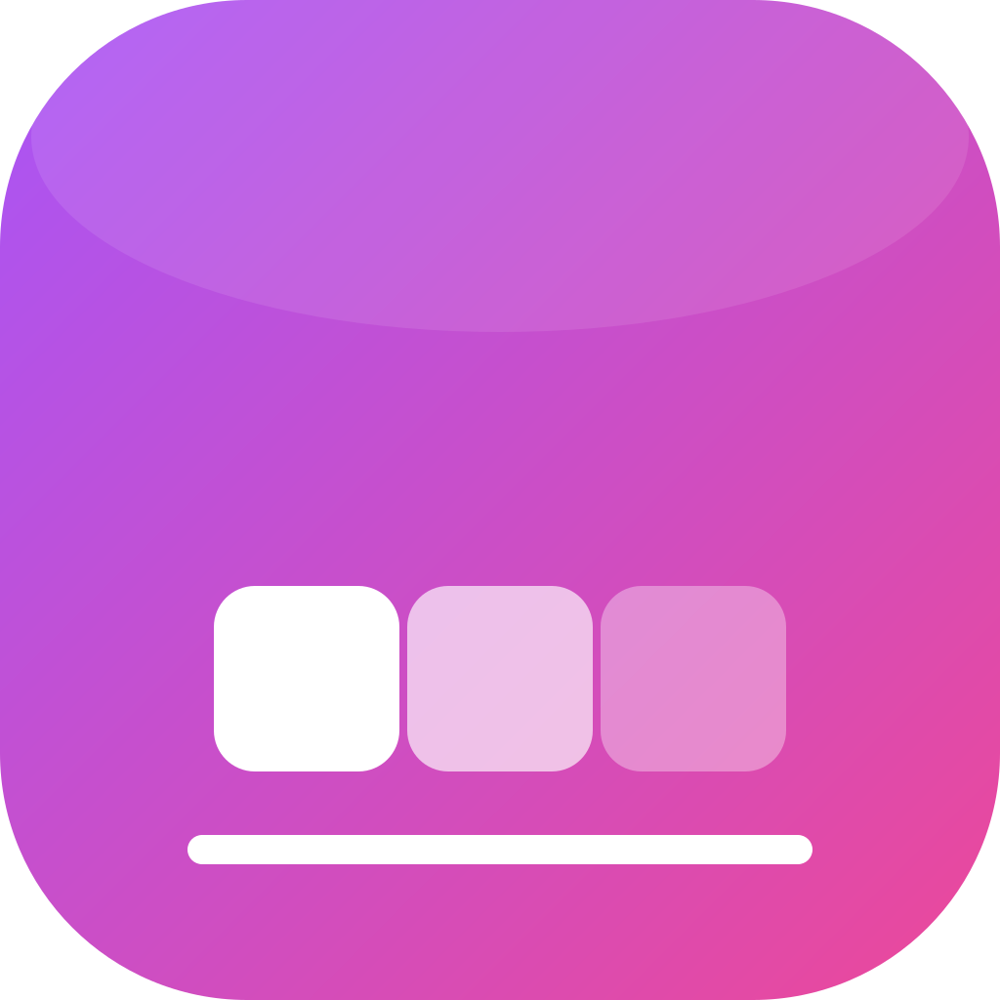

<p align="center">
  
</p>

# DockXI — Floating Dock for Windows

A lightweight, macOS-style floating dock for Windows. Built on **WPF + .NET 8**.


> Pin your apps, folders, and files in a floating dock that hovers on any screen edge.
> Drag to reorder, hover to lift, right-click to manage — clean, fast, native.

---

## Features

- **Floating dock** — always on top, position on any screen edge (Top / Bottom / Left / Right)
- **Auto-hide + reveal zone** — dock shrinks to a small pill at the screen edge when idle, slides back out when you brush the edge
- **Unlimited pins + overflow scrolling** — no icon cap; when tiles outgrow the monitor the dock stops growing and the mouse wheel scrolls them
- **Hover lift** — icons rise smoothly when the cursor passes over them
- **Drag-to-reorder** — neighbouring icons split aside with orientation-aware push-aside and insert separator
- **Drag-in to pin** — drop a file / folder from Explorer onto the dock to pin it (works as Admin via UAC bypass)
- **Drag-out to unpin** — pull a tile off the dock to remove it; pop-in / shrink-out bounce animations
- **Running indicator** — accent dot under tiles whose app is running
- **Broken target badge** — red **!** when the pinned target file is missing
- **Per-tile context menu** — right-click an icon to delete it
- **Activity log** — every pin / unpin / launch / position change recorded to `logs/activity.log` (rotates at 1 MB)
- **Dark theme** — matches Windows 11 dark style, transparent rounded plate

## Quick Start

Requires **Visual Studio 2022** with the **".NET desktop development"** workload.

```powershell
git clone <repo-url>
cd "DockXI - Floating Dock\DockXI"
dotnet restore
dotnet build DockXI.sln -c Release
dotnet run --project src\DockXI.UI
```

Or open `DockXI/DockXI.sln` in VS and press **F5**.

### Build outputs

| Configuration | Command | Output | What it is |
|---------------|---------|--------|------------|
| **Debug** | `dotnet build` (or F5) | `src\DockXI.UI\bin\x64\Debug\net8.0-...\DockXI.exe` | Unoptimised dev build with debug symbols |
| **Release** | `dotnet build -c Release` | `src\DockXI.UI\bin\x64\Release\net8.0-...\win-x64\DockXI.exe` | Optimised, **framework-dependent**: small exe + its DLLs beside it; the target machine must have the .NET 8 Desktop Runtime |
| **Publish** | `dotnet publish src\DockXI.UI -c Release` | `src\DockXI.UI\bin\x64\Publish\DockXI-v<version>-win-x64\DockXI.exe` (+ `.zip`) | **Self-contained single file**: the .NET runtime, WPF and every dependency are packed inside one large exe — copy/unzip anywhere and run, no install needed |

Publish options (`SelfContained`, `PublishSingleFile`, versioned output folder + zip)
live in `src\DockXI.UI\DockXI.UI.csproj`, not in the `.pubxml` — see the comment
inside `Properties\PublishProfiles\FolderProfile.pubxml`.

## Project Layout

```
DockXI/                ← Visual Studio solution
   src/
      DockXI.Core/       ← Domain services + interfaces (Abstractions/)
      DockXI.UI/         ← WPF app (App, MainDockWindow, view-model)
   tests/
      DockXI.Tests/      ← xUnit unit + integration tests
docs/                  ← Requirements spec (.docx)
mockups/               ← UI design mockup (HTML)
```

See **[`DockXI/README.md`](DockXI/README.md)** for architecture, build, and developer guide.

## Tech Stack

- **WPF** (`net8.0-windows10.0.19041.0`) — native Windows shell
- **GongSolutions.Wpf.DragDrop** — drag-reorder + external file drop
- **Microsoft.Extensions.Hosting** — DI container + app lifecycle
- **xUnit + Moq** — testing

## Status

**v1.0.0** — first stable release. Full workflow ships: pin / launch / reorder / drag-drop / auto-hide. Multi-monitor selection is on the roadmap.

## License

MIT — see [LICENSE](DockXI/LICENSE).
